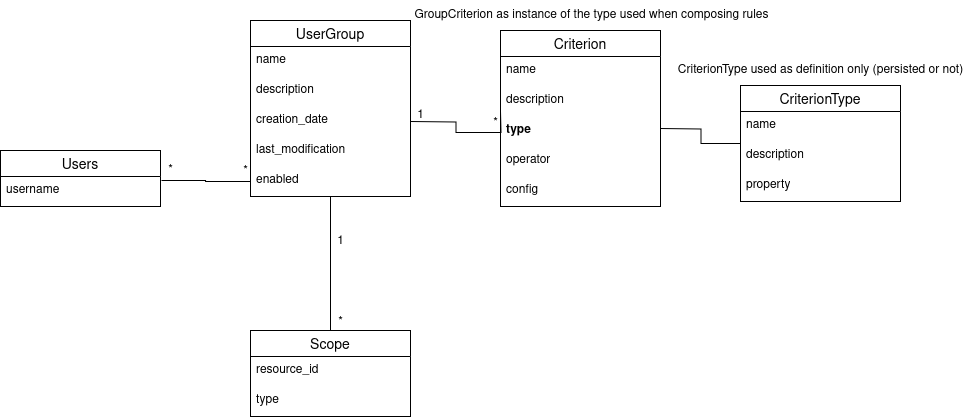

0002: User Groups Model Foundations
###################################

Status
******
**Draft**

Context
*******

Open edX currently relies on multiple user grouping mechanisms (cohorts, teams, course groups), each with distinct limitations and challenges. These models are difficult to extend, duplicate logic across the platform, and are not designed for reuse in contexts like messaging, segmentation, or analytics.

There is increasing demand for more flexible grouping capabilities, including dynamic membership based on user behavior or attributes. At the same time, existing grouping systems offer rigid schemas and limited extensibility, making it hard to adapt to evolving needs.

The user groups project aims to address these challenges by creating a unified, extensible user groups model that can be used across the Open edX platform. This new model will provide a foundation for managing user groups in a more flexible and powerful way, allowing for better segmentation, messaging, and analytics capabilities.

Some of the key goals of the user groups project include:

* Support dynamic grouping strategies by allowing user groups to be defined based on shared attributes, behaviors, or platform activity, not just manual or random assignment.
* Unify user grouping mechanisms by replacing fragmented models (cohorts, teams, course groups) with a single, consistent data structure and interface.
* Decouple user groups from specific features to support reuse across diverse contexts, such as content access, discussions, messaging, and analytics.
* Standardize group modeling and storage to reduce duplication, improve clarity, and simplify development and operational workflows.
* Enable extensibility by supporting configurable, pluggable criteria that allow new grouping behaviors without modifying core platform code.

This ADR documents the key architectural decisions for the unified user groups system's foundational data model and conceptual framework.

**Integration Context**: This model will be implemented as a Django app plugin that can be installed into existing Open edX instances, as described in :doc:`0001-purpose-of-this-repo`. The evaluation engine and runtime architecture that operate on these foundational models are detailed in ``ADR 0003: Runtime Architecture``. This ADR is independent of the runtime architecture and can be implemented in isolation.

The next ADRs will build on this foundational model to implement the entire user groups system that will function as a whole.

Data Model Architecture Overview
=================================

This ADR establishes the foundational data structures that enable flexible, extensible user grouping in Open edX. The model design supports both simple manual groups and complex dynamic segmentation through a unified approach.

**Core Model Relationships:**

   Entity relationship diagram showing the core data model with UserGroup, Scope, Criterion, CriterionType, and Users entities. Note that CriterionType is used as a definition template and may or may not be persisted depending on the runtime implementation.

**Key Design Principles:**

1. **Unified Model**: Single UserGroup entity replaces fragmented legacy systems (cohorts, teams, course groups)

2. **Scope Constraints**: Groups are explicitly bounded to prevent invalid cross-context usage

3. **Extensible Criteria**: Rules stored as generic JSON configurations that map to pluggable Python classes

4. **Materialized Membership**: User-group relationships are persisted for performance and consistency

5. **Derived Group Types**: Manual vs Dynamic classification emerges from configured criteria rather than explicit fields

**Data Flow Example:**

.. code-block:: text

   Group Definition:
   ├── UserGroup: "At Risk Students"
   ├── Scope: Course "CS101"
   └── Criteria:
       ├── Criterion 1: {type: "last_login", operator: ">", config: {"days": 30}}
       └── Criterion 2: {type: "course_progress", operator: "<", config: {"percent": 40}}

   Storage Result:
   └── UserGroupMembership: [(user1, group), (user3, group), (user5, group)]

**Extensibility Points:**

* **New Criterion Types**: Add without schema migrations (JSON config + Python class)
* **Multiple Scopes**: Support any content object through generic foreign keys
* **Complex Logic**: Evolution path from simple AND to boolean expression trees
* **Backward Compatibility**: Versioned criterion types enable safe evolution

This foundational model provides the storage and structural foundation that the runtime architecture (ADR 0003) will operate upon to deliver dynamic user grouping capabilities.

Decision
********

I. Foundation Models
====================

Introduce a unified ``UserGroup`` model with explicit scope constraints
-----------------------------------------------------------------------

To create a unified user groups model, we will:

* Introduce a single ``UserGroup`` model to represent user segmentation across the Open edX platform, replacing legacy group models like cohorts, teams, and course groups.
* Include an explicit scope field that defines whether the group applies at the course, organization, or platform level to ensure groups are only used where intended.
* Use a unique constraint (name, scope) to avoid duplicate group names within the same scope.
* Use a generic foreign key for the scope model to support any kind of object but initially limit to existing entities: course, organization, instance.
* Store essential metadata directly in the model, including name, description, enabled status, and timestamps, to support management and traceability.

Separate group membership storage and allow multiple group participation
------------------------------------------------------------------------

To decouple group definition from membership state and support flexible segmentation, we will:

* Define a join table (``UserGroupMembership``) to persist the list of users assigned to each group.
* Use this table for both manual and dynamic groups to standardize downstream access.
* Allow users to belong to multiple groups, even within the same scope, unless constrained by other mechanisms referencing the group.
* Store membership metadata such as timestamps for when a user was added or removed, to support auditing and traceability.
* Ensure services can reference group membership directly without requiring on-demand evaluation.

Store operational metadata without full audit history
-----------------------------------------------------

To support minimal traceability without overloading the schema, we will:

* Include fields like created, updated, enabled, last_refresh, and member_count directly in the ``UserGroup`` model.
* Avoid embedding full audit trails (e.g., historical criteria changes or user diffs) in the model.
* Rely on logs, analytics systems, or external audit services for long-term tracking and monitoring.

Define group types based on their configured criteria
-----------------------------------------------------

To distinguish between different group population methods while maintaining a unified model, we will:

* Define group types as the method by which a user group is populated, with two primary modes:

  * **Manual**: Users are explicitly assigned to the group through administrative interfaces.
  * **Dynamic**: Membership is computed based on one or more criterion rules, allowing for automatic updates as user attributes or behaviors change.

* Define group types (Manual vs Dynamic) based on the criterion types configured for each group rather than as a separate field.
* Treat group type as a derived characteristic that determines whether the group will be automatically updated.
* Allow groups to evolve from manual to dynamic by changing their configured criteria without requiring model changes.
* Use group type primarily as nomenclature to help administrators understand how a group is populated.

II. Extensible Criterion Framework
===================================

Store criterion types as string identifiers for runtime resolution
------------------------------------------------------------------

To enable extensible criterion definitions without database schema changes, we will:

* Represent each criterion type using a string identifier (e.g., "last_login", "course_enrollment") that maps to a Python class responsible for evaluation and validation logic.
* Store criterion type identifiers in the database rather than creating separate models for each criterion type, avoiding schema-level coupling and the need for migrations when adding new types.
* Enable criterion types to be defined as pluggable Python classes that can be loaded and resolved at runtime through a registry system (implementation details covered in ADR 0003).
* Select this pattern over a model-subtype approach to maintain schema flexibility and support plugin-based development workflows without requiring database changes.

Define generic criterion storage with extensible validation
-----------------------------------------------------------

To support flexible, extensible rule definitions without schema changes, we will:

* Store each criterion as a single record with three fields:

  * ``type``: identifies the criterion type class (e.g., "last_login")
  * ``operator``: the comparison logic (e.g., >, in, !=, exists)
  * ``config``: a JSON-encoded configuration object (e.g., 30, ["es", "fr"])

* Use a single shared ``Criterion`` table to store all criterion records, with each record belonging to a specific group.
* Enable consistent storage of all criterion types regardless of data source, scope, or logic while maintaining group-specific criterion instances.
* Delegate validation responsibility to the criterion type class rather than enforcing structure at the database level.
* Store configuration as unstructured JSON to support heterogeneous criterion types while maintaining schema flexibility. The logic for validation and evaluation is defined in the criterion type class.

Define criterion types as reusable templates across groups
----------------------------------------------------------

To enable reuse of criterion type definitions across groups while maintaining isolation, we will:

* Use criterion types as templates that define how a criterion behaves: name, configuration model, supported operators, evaluator, and validations. For example:

  * ``name``: the name of the criterion type (e.g., "last_login"). This is the ID of the criterion type, and should be unique across the system.
  * ``class ConfigModel(BaseModel)``: a pydantic model that defines the configuration schema for the criterion type. This is used to validate the configuration of the criterion when it is created or updated.
  * ``supported_operators``: the list of operators supported by the criterion type. This is used to validate the operator of the criterion when it is created or updated.
  * ``def evaluate(self) -> QuerySet``: the Python class method responsible for evaluating the criterion. This is used to evaluate the criterion.

* Enable the reuse of criterion type definitions across multiple groups, with isolation achieved by storing separate criterion records for each group in the shared ``Criterion`` table.
* Allow different groups to configure the same criterion type independently (e.g., "last_login" with different day thresholds).
* Store criterion records as group-specific entries; there is no global repository of shared criterion instances between groups.
* Enable group owners or plugins to evolve their criterion configurations independently without introducing shared state or coupling.

Evolve from simple criteria to logic trees for complex boolean expressions
--------------------------------------------------------------------------

To support the evolution from simple AND-only combinations to complex boolean logic, we will:

* **Initial Implementation**: Start with individual criterion records that are combined using only AND logic (all criteria must be satisfied). This provides a foundation for basic dynamic grouping where users must meet all specified conditions.

* **Advanced Implementation**: Introduce logic trees to express complex conditions that require OR logic, such as last_login AND (course_progress OR course_grade). This advanced structure is necessary because the basic implementation cannot represent OR relationships between criteria::

    {
      "AND": [
        { "type": "last_login", "operator": "...", "config": ... },
        {
          "OR": [
            { "type": "course_progress", "operator": "...", "config": ... },
            { "type": "course_grade", "operator": "...", "config": ... }
          ]
        }
      ]
    }

* Use criterion type templates (Python classes) for reusing definitions across groups without persisting criterion type instances. By evolving to a logic tree, we can support complex boolean expressions while maintaining the same level of validation through the criterion type classes without having an additional model to manage.
* Allow complex boolean expressions while maintaining the same level of validation through the criterion type classes.
* Ensure the logic tree can be evaluated in a predictable order, respecting operator precedence and grouping.
* The logic tree is a tree of criterion types, where each criterion type is a node in the tree. The tree is evaluated by traversing the tree in a depth-first manner, respecting operator precedence and grouping.

Restrict criterion types by scope and enforce compatibility
-----------------------------------------------------------

To prevent invalid configurations and ensure rules apply only where meaningful, we will:

* Define criterion types with a declared scope (e.g., course, organization, instance).
* Identify criterion types by the pair <type_name, scope> so that "last_login" for a course may differ from "last_login" at the organization level.
* Allow only criterion types matching the group's scope to be used when configuring a group.
* Enforce this constraint at the criterion type class level during group creation or update.

Support exclusion logic through operators rather than separate mechanisms
-------------------------------------------------------------------------

To simplify the model and unify rule semantics, we will:

* Express exclusion (e.g., "users not in country X") using standard operators like !=, not in, and not exists.
* Allow all inclusion and exclusion logic to be handled using the same criterion structure, reducing complexity and duplication.
* Avoid defining separate anti-criterion concepts to maintain consistency across the framework.

Version criterion types to ensure behavioral consistency
--------------------------------------------------------

To ensure expected behavior is maintained throughout releases and system evolution, we will:

* Version criterion types by including version numbers in the type identifier (e.g., "ProgressCriterionV2", "LastLoginV1").
* Store the version number alongside the type name in the database to maintain explicit tracking of which version is being used.
* Allow gradual migration of existing configurations to new versions, ensuring users can continue using the system without disruption.
* Enable backward compatibility by supporting multiple versions of the same criterion type simultaneously.
* Provide clear migration paths when criterion type behavior changes significantly between versions.

Dependencies
************

The decisions in this ADR have the following dependencies:

**Foundation Dependencies:**
* The **UserGroup model with scope constraints** forms the base that all other decisions build upon.
* **Group types based on configured criteria** depends on the criterion framework decisions in Section II.
* **Separate membership storage** provides the foundation for runtime evaluation (handled in ADR 0003).

**Criterion Framework Dependencies:**
* **Generic criterion storage** must be established before **reusable templates** can be implemented.
* **Scope restrictions** and **versioning** can be implemented independently once the basic criterion framework exists.
* **Template definitions** provide the foundation for runtime registry and validation (handled in ADR 0003).

**Cross-ADR Dependencies:**
* The runtime architecture defined in ``ADR 0003: Runtime Architecture`` depends on all foundational decisions in this ADR, particularly the unified model and criterion storage framework.
* The evaluation engine, registry system, and validation logic in ADR 0003 operate on the data structures defined in this ADR.

Consequences
************

1. A unified ``UserGroup`` model will replace legacy grouping mechanisms (cohorts, teams, course groups), providing consistent management and application of user groups across the Open edX platform.

2. The separation of group membership from group definition will enable more flexible and dynamic user grouping strategies, reducing duplication of logic across the platform.

3. Making the ``UserGroup`` agnostic to specific features will allow it to be reused across different contexts, such as content gating, discussions, messaging, and analytics without requiring custom implementations for each use case.

4. The extensible criterion framework will allow new grouping behaviors to be added without modifying core platform code, enabling rapid iteration and plugin-based development.

5. The registry-based approach will eliminate migration overhead for new criterion types while maintaining type safety through runtime validation.

6. The versioning system for criterion types will allow for changes to be made without breaking existing configurations, ensuring backward compatibility as the system evolves.

7. The scope-based restriction of criterion types will prevent invalid configurations and ensure rules apply only where meaningful, improving clarity and usability.

8. The validation logic within each criterion type will ensure that configurations are correct and consistent, reducing the risk of errors and improving reliability.

9. The logic tree structure will enable complex boolean expressions while maintaining predictable evaluation order and hierarchy.

10. The unified evaluation interface will simplify the evaluation engine implementation by providing consistent access patterns for both manual and dynamic groups.

11. The composable rule system will allow for complex group definitions using combinations of different criterion types, enabling sophisticated user segmentation strategies.

12. The overall design will create a foundation for advanced user segmentation features, such as messaging, analytics, and reporting, by providing a consistent and extensible model.

Rejected Alternatives
**********************

Model-based Criterion Type Implementation
=========================================

Another alternative for defining criterion types in the user groups project was a model-based approach, where each criterion type would be represented as its own Django model. This approach, while providing a clear separation of concerns and allowing for complex criterion type definitions, had several drawbacks that led to its rejection.

In this approach, each criterion type is represented as its own Django model, inheriting from a shared base class. These models define the fields required for their evaluation (such as a number of days, grade, etc) and include a method to return matching users. Evaluation is done by calling each model's method during group processing.

This structure allows clear separation between criterion types and their usage, and relies on Django's ORM relationships to manage them. New types are introduced by creating new models and registering them so the system can discover and evaluate them when needed.

This design is inspired by model extension patterns introduced in `openedx-learning for content extensibility <https://github.com/openedx/openedx-learning/blob/main/docs/decisions/0003-content-extensibility.rst>`_.

**Pros:**

* Clear separation of concerns between different criterion types.
* Each type can have its own fields and validation logic out-of-the-box, making it easy to extend.
* Supports advanced use cases for complex criterion types that require multiple fields or relationships.
* Allows for easy discovery and evaluation of criterion types through Django's model registry.
* The responsibility of each criterion type is handled by the models, while each group criterion manages the usage of the model (less coupling).

**Cons:**

* Introduces additional complexity with multiple models and relationships, which can make the system harder to maintain.
* Each new criterion type requires a model and a migration. Even small changes involve versioning and review, which slows down iteration and increases maintenance effort.
* Fetching and evaluating criterion types across multiple models requires a more complex implementation that may be more difficult to implement and debug.
* May lead to performance issues if many criterion types are defined, as each type requires its own database table.
* The model-based approach may not be as flexible as a registry-based system, where new types can be added without requiring migrations or changes to the database schema.

Because of these drawbacks, we decided to use a registry-based approach for defining criterion types, which allows for greater flexibility and extensibility without the overhead of managing multiple models and migrations.

For more details on the model-based approach, see the `Model-based Criterion Type Implementation <https://openedx.atlassian.net/wiki/spaces/OEPM/pages/4923228186/Model-based+Criteria+Subtypes>`_ section in the User Groups confluence space.

References
**********

Confluence space for the User Groups project: `User Groups confluence space <https://openedx.atlassian.net/wiki/spaces/OEPM/pages/4901404678/User+Groups>`_.
