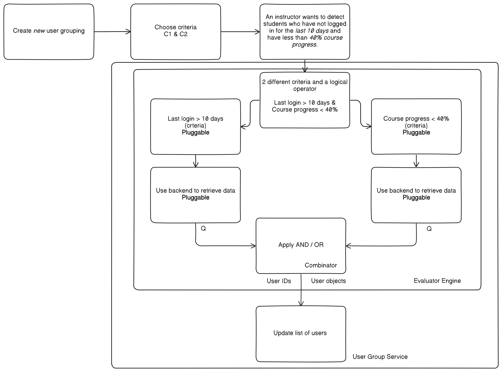

0003: Runtime Architecture for Criteria Evaluation and Plugin Discovery
#######################################################################

Status
******

**Draft**

Context
*******

The :doc:`0002-user-groups-model-foundations` introduced a unified model for user groups based on configurable, pluggable criteria. The foundational model defines the data structure, scope constraints, and the decision to use registry-based criterion types that can be dynamically evaluated against user data.

To make this foundation functional, we need a runtime architecture that enables dynamic evaluation, plugin discovery, and backend integration for data retrieval. This ADR defines how the pluggable criterion system works in practice, ensuring a flexible, scalable, and extensible runtime system that supports new criteria types, reusable data access patterns, and consistent evaluation performance.

The chosen approach prioritizes extensibility and operational efficiency through runtime registration while accepting increased runtime overhead as a necessary trade-off for long-term maintainability and plugin ecosystem support.

Architectural Overview
======================

The runtime architecture orchestrates four main components to transform static group definitions into dynamic user membership:

**High-Level Flow:**

   Complete runtime flow showing the interaction between pluggable criteria, backend data retrieval, evaluation engine, and user group service. This example demonstrates creating a group for "students who have not logged in for more than 10 days AND have less than 40% course progress."

**Component Interaction:**

1. **Plugin Discovery**: The Criteria Registry loads and validates all available criterion types at startup, making them available for group configuration.

2. **Group Configuration**: When creating a group, the system validates that specified criterion types exist in the registry and are compatible with the group's scope.

3. **Dynamic Evaluation**: The Evaluation Engine orchestrates membership computation by:

   * Loading criterion instances from the registry
   * Using Backend Clients to access required data (users, enrollments, etc.)
   * Combining individual criterion results using boolean logic
   * Updating the membership storage

4. **Data Abstraction**: Backend Clients provide a unified interface to different data sources, allowing criteria to focus on business logic rather than data access details.

This architecture enables the system to scale from simple manual groups to complex dynamic segmentation while maintaining consistent interfaces and extensibility points.

Decision
********

I. Extensible Parts of the Model
=================================

This section establishes the foundation for extensibility by defining how new data sources and criterion types can be added to the system without modifying core. The key insight is separating data access concerns from business logic through backend abstraction.

Define extensible data sources and criteria types
-------------------------------------------------

To enable extensibility without modifying core platform code, we will support two main extension points:

* **Data Sources**: Developers will be able to connect new data sources by providing backend clients and registering them through configurations. The system will provide reusable tools (e.g., query helpers) to make it easier to get the needed data.
* **Criteria Types**: Developers will be able to define new ways of selecting users (e.g., "Visited unit X") along with the logic and fields needed to evaluate them, following the Registry-Based Criteria Subtypes approach from :doc:`ADR 0002 <0002-user-groups-model-foundations>`.

Adopt backend-managed data access with scope-aware abstraction
--------------------------------------------------------------

To avoid duplication and maintain clean separation of concerns, we will adopt a backend-managed data access approach where:

* **Backend Ownership**: Backend clients handle all data retrieval operations, with scopes used by backends to get objects that will be used by criterion types.
* **Criterion Responsibility**: Criterion types do not directly query databases or data sources; instead, they use the configured backend client to fetch data and are only responsible for filtering and applying their specific logic.
* **Scope Integration**: Backend clients provide scope-aware methods that handle different contexts (course-level, organization-level, instance-level), using scopes to determine the appropriate data boundaries for queries.
* **Dependency Injection Model**: The evaluation engine injects the appropriate backend clients into criterion types during evaluation, matching backends to criterion configuration requirements.
* **Interface Abstraction**: All backend clients inherit from a common ``BackendClient`` base class and provide a consistent interface for data retrieval, allowing criterion types to remain agnostic of the underlying data source implementation.
* **Data Format Standardization**: All backends with Django ORM access return QuerySet objects rather than materialized lists to enable lazy evaluation, query composition, and efficient optimization through Django's Q objects and database-level operations.
* **Non-ORM Backend Support**: Backends without ORM access return user ID lists that can be converted to QuerySets for consistency.

This approach will be preferred over criterion-owned queries where each criterion type manages its own data access and queries directly, which could incur duplicated efforts and violate separation of concerns.

Enable registration of new backends and methods
-----------------------------------------------

To support extensibility of data sources, we will:

* Allow registration of new backend clients through Django configuration settings, enabling developers to define their own backend clients that inherit from the base ``BackendClient`` class.
* Support configuration of multiple backends for different data sources, with each backend registered and discoverable through Django's configuration system.
* Enable the same base backend type to be configured differently for different deployment environments.
* Provide a registry mechanism that allows the evaluation engine to discover and select appropriate backends based on criterion type requirements.

II. Criteria Template Classes and Base Framework
================================================

This section defines how criterion type templates from :doc:`0002-user-groups-model-foundations` become functional criteria types. The focus is on creating a consistent interface that enables validation, configuration, and evaluation while maintaining flexibility for diverse criterion types.

Adopt runtime framework approach for criterion type templates
-------------------------------------------------------------

Building upon the :doc:`criterion type templates defined in ADR 0002 <0002-user-groups-model-foundations>`, which established reusable templates that define how criteria behave (name, config model, supported operators, evaluator, and validations), we will adopt the runtime framework approach that enables these templates to function as pluggable Python classes.

To establish a consistent runtime interface for all criterion type templates, we will define a base criterion class that includes:

* **Name**: How to identify the criterion type.
* **Config Model**: Schema definition for criterion configuration.
* **Supported Operators**: List of valid operators for this criterion type.
* **Evaluator**: Method that performs the actual user selection logic.
* **Helper Methods**: Common utilities for criterion processing.

Use criterion-managed schema validation approach
------------------------------------------------

To ensure configuration correctness and provide structured validation, we will:

* Delegate all validations to the criterion type class itself instead of API layer.
* Use Pydantic models within each criterion type to validate configuration structure and operator compatibility.
* Execute validation when groups are saved, as criterion instances are created during the group creation process.
* Allow configuration validation to fail gracefully with clear error messages for invalid configurations.
* Allow developers to define configuration fields for the criterion in the criterion type Python class itself.

Delegate all criteria-specific logic to the criterion type class
----------------------------------------------------------------

To implement the schema-light database design established in ADR 0002 while ensuring complete encapsulation of criterion behavior, we will:

* Delegate all criteria-specific logic to the criterion type class, making it responsible for:

  * **Configuration validation**: Define accepted operators (e.g., >, !=, in) and expected configuration schema (e.g., integer days, list of strings)
  * **Data access**: Handle retrieval of user data needed for evaluation
  * **Evaluation logic**: Implement the core logic that determines which users match the criterion
  * **Schema definition**: Expose machine-readable configuration requirements for UI generation
  * **Error handling**: Provide clear error messages for invalid configurations

* Keep the model schema minimal and extensible by not enforcing structure or constraints on the config field at the database level.
* Execute validation when groups are created or updated, ensuring criterion configurations are validated before being saved to the database.
* Enable extension without schema migrations by shifting all enforcement to the type layer.
* Ensure consistent behavior across all criterion types by requiring each type class to implement the complete interface.

III. Runtime Registry System
============================

This section establishes how the system discovers and manages available criterion types at runtime. The registry serves as the central authority for criterion types, enabling dynamic loading, conflict detection, and plugin ecosystem support.

Implement registry-based criterion types with runtime resolution
----------------------------------------------------------------

To provide runtime implementation of the string-based criterion type storage established in ADR 0002, we will:

* Load criterion type classes at application startup through a plugin discovery mechanism and register them in a centralized registry.
* Map criterion type string identifiers (stored in the database) to their corresponding Python classes at runtime.
* Encapsulate evaluation logic, schema validation, supported operators, and configuration handling within each criterion type class.
* Enable dynamic binding of behavior without requiring schema changes or migrations when new criterion types are added.
* Support plugin-based development workflows where third-party packages can register new criterion types through entry points.
* Implement graceful fallback when criterion type classes are missing or unregistered to preserve application stability.

Adopt centralized criteria registry for runtime resolution
----------------------------------------------------------

To dynamically resolve behavior associated with each rule type, we will:

* Load criteria type classes at application startup and register them in a centralized registry.
* Resolve each ``Criterion.type`` string at runtime using this registry to retrieve the correct logic and config schema.
* Use this registry as the single source of truth for all supported rule types.
* Fail gracefully when a type is missing or unregistered, preserving application stability and deferring error to evaluation or validation time.

Use stevedore-based plugin discovery for criterion types
--------------------------------------------------------

To enable extensible criterion registration in a dynamic-flexible way, we will:

* Use `stevedore <https://docs.openstack.org/stevedore/>`_ entry points (building on plugin mechanism) to discover and load criterion type classes at application startup, registering them in the centralized registry.
* Define a standard entry point format for criterion types that includes the class name and module path.
* Register new criterion types using entry point format in setup.py::

    "openedx_user_groups.criteria": [
        "last_login = openedx_user_groups.criteria.examples:LastLoginCriterion",
        "country = openedx_user_groups.criteria.examples:CountryCriterion"
    ]

* Allow third-party plugins to register their own criteria types by defining them in their `Open edX Django plugin <https://docs.openedx.org/projects/edx-django-utils/en/latest/plugins/readme.html>`_ configuration.
* Ensure the system automatically discovers and integrates new criteria using stevedore.
* Support association at load-time of criterion type classes so they are linked to corresponding models.

Use INSTALLED_APPS-like mechanism for criterion registration and duplicate detection
-------------------------------------------------------------------------------------

To manage criterion type registration and detect conflicts systematically, we will:

* Implement a registration mechanism similar to Django's ``INSTALLED_APPS`` that tracks registered criterion types during application initialization.
* Detect duplicate criterion type names during application startup and provide clear feedback to operators.
* Enable operators to identify conflicts when the application initializes, allowing them to resolve issues before runtime.
* Maintain a registry of criterion types that provides visibility into which plugins have registered which criterion types.
* Use this mechanism to ensure predictable behavior when multiple plugins attempt to register criterion types with the same name.
* Provide clear error messages or warnings that help operators understand the source of conflicts and how to resolve them.

IV. Evaluation Engine and Membership Computation
================================================

This section defines the core runtime component that transforms group criteria into actual user membership. The evaluation engine orchestrates the entire process from criterion loading to membership storage, supporting both simple AND logic and complex boolean expressions.

Introduce an evaluation engine to resolve dynamic group membership
------------------------------------------------------------------

To compute user membership for criteria-based groups, we will:

* Use an evaluation service that iterates over a group's configured ``Criterion`` entries.
* Load the appropriate criteria type class via the registry for each rule, associating criterion type strings with their runtime classes.
* Inject the appropriate backend client into each criterion type for data access.
* Invoke the logic defined in each criteria type class (the evaluator method) to return a list of matching user IDs.
* Combine the results across multiple rules using the group's configured logical operator (AND/OR).
* Write the final list of user IDs to the ``UserGroupMembership`` table, overwriting previous entries by combining the standardized format returned by each criteria type class.

Construct rule trees for complex criteria combinations
------------------------------------------------------

To support complex boolean expressions in group membership rules as defined in the :doc:`logic tree structure in ADR 0002 <0002-user-groups-model-foundations>`, the evaluation engine will:

* Construct a rule tree that represents the logical structure of the criteria.
* Use a recursive approach to evaluate the tree, executing the most selective criteria first to reduce dataset size early.
* Optimize the combination of criteria using query planning mechanisms, allowing for efficient execution of AND/OR combinations.
* Allow backend clients to share query logic across criteria types to minimize duplicate database operations.

Evaluate dynamic groups through criterion-based computation
-----------------------------------------------------------

To implement the materialized membership storage established in ADR 0002, we will:

* Treat dynamic group membership as derived data, computed by evaluating the group's criteria against the available user data.
* Store the evaluation result in the ``UserGroupMembership`` table, replacing any previous members for that group.
* Evaluate dynamic groups periodically or on demand to keep their membership current with changing user attributes and behaviors.
* Use the same membership storage model for both manual and dynamic groups to ensure consistent downstream access patterns.
* Coordinate with the backend client system to efficiently retrieve user data for evaluation.

Provide unified evaluation interface for all group types
--------------------------------------------------------

To implement the unified group type approach established in ADR 0002, we will:

* Design all group types to use the same evaluation interface, whether they are manual or dynamic.
* Implement manual groups through a special criterion type that handles explicit user assignment.
* Enable consistent access patterns across all group types by using the same ``UserGroupMembership`` table and evaluation workflow.
* Ensure the evaluation engine can process any group type without requiring special handling based on the group's population method.
* Support the derived group type classification by determining type based on the configured criterion types.

V. Orchestration Layer and Integration
======================================

This section defines how all the runtime components work together through high-level orchestration functions. It establishes clean separation between business logic and data models while enabling dynamic UI generation and flexible group management workflows.

Use orchestrator functions for group operations management
----------------------------------------------------------

To provide a unified interface for group operations, we will:

* Implement orchestrator functions that coordinate group operations and business logic in the API layer.
* Provide high-level group management through orchestrator functions that encapsulate:

  * Group creation and management with associated criteria.
  * Dynamic evaluation of group membership based on defined criteria.
  * Criterion type resolution using the centralized registry.
  * Backend client coordination for data retrieval operations.

* Manage registry resolution, evaluation orchestration, and backend client interactions behind orchestrator functions in the API layer.
* Support both re-evaluation and appending of new users depending on the update strategy defined (daily update, manual CSV upload vs event-based).

Keep business logic in API layer to maintain lightweight models
----------------------------------------------------------------

To ensure clean separation of concerns and maintain model flexibility, we will:

* Concentrate the majority of business logic in the API layer rather than in Django models.
* Keep the model layer lightweight and agnostic to business constraints and requirements when possible.
* Use orchestrator functions to handle complex business rules, validation logic, and workflow coordination.
* Maintain models as simple data containers that focus on data integrity and basic relationships.
* Enable the model layer to remain flexible and reusable across different business contexts by avoiding tight coupling to specific business rules.

Enable dynamic UI generation through schema introspection
---------------------------------------------------------

To support flexible administrative interfaces, we will:

* Require each criterion type to expose its configuration schema in machine-readable format.
* Use criterion type schemas to dynamically generate form fields in administrative and course staff interfaces.
* Provide schema introspection APIs that allow UI components to:

  * Discover available criterion types for a given scope.
  * Retrieve configuration requirements for each criterion type.
  * Validate user input against criterion type schemas before submission.

* Ensure schema definitions include sufficient metadata for generating user-friendly form interfaces through UI slots specific for criterion types.
* Allow operators to extend or customize UI generation by providing additional metadata in the schema.

Dependencies
************

**Cross-ADR Dependencies:**

This ADR builds entirely upon the foundational decisions established in :doc:`0002-user-groups-model-foundations`:

* **Criterion Framework Dependency**: The runtime registry system implements the registry-based criterion types defined in ADR 0002.
* **Evaluation Interface Dependency**: The evaluation engine implements the unified evaluation interface established in ADR 0002.
* **Data Model Dependency**: All runtime components operate on the UserGroup, Criterion, and UserGroupMembership models defined in ADR 0002.

**Internal Runtime Dependencies:**

Within this ADR, the decisions have the following dependencies:

* **Plugin Discovery** (stevedore-based) must be established before the **centralized registry** can function.
* **Backend client abstraction** is required by **criterion type classes** for data access.
* **Evaluation engine** depends on both **registry system** and **backend clients** to function.
* **Orchestration layer** depends on all lower-level components: registry, backends, and evaluation engine.
* **Schema introspection** depends on **criterion type classes** defining their configuration schemas.

Consequences
************

1. The stevedore-based plugin system enables third-party developers to extend grouping capabilities without requiring changes to core platform code, promoting ecosystem growth.

2. The plugin discovery mechanism creates a clear extension point for operators and third parties, encouraging the development of domain-specific criterion types.

3. The Django configuration-based backend registration system allows for flexible data source integration without core code modifications.

4. The centralized registry provides consistent criterion type resolution across the application while supporting dynamic discovery of new types.

5. The backend client abstraction enables integration with diverse data sources while maintaining clean separation between data access and evaluation logic.

6. The evaluation engine provides scalable and efficient group membership computation through query optimization and lazy evaluation strategies.

7. The dependency injection pattern for backend clients improves testability by enabling easy mocking and substitution of data sources during testing.

8. The architecture supports performance optimization through query planning and backend client reuse, enabling the system to scale with large user populations.

9. The backend-managed loading approach prevents code duplication while maintaining clean separation between data access and evaluation logic.

10. The rule tree construction and optimization enables complex boolean expressions to be evaluated efficiently, allowing for flexible grouping logic without sacrificing performance.

11. The orchestrator functions abstract runtime complexity and provide clear interfaces for developers while reducing the likelihood of incorrect direct registry or backend usage.

12. Schema-based validation ensures configuration correctness while enabling dynamic UI generation, improving both developer and operator experience.

13. The runtime validation system catches configuration errors early, reducing the likelihood of broken group definitions in production environments.

14. The orchestrator functions provide a clean interface that abstracts runtime complexity from business logic.

Rejected Alternatives
**********************

Overload Model Layer with Business Logic
========================================

Another alternative for defining criterion types in the user groups project was a model-based approach, where each criterion type would be represented as its own Django model. This approach, while providing a clear separation of concerns and allowing for complex criterion type definitions, had several drawbacks that led to its rejection.

In this approach, each criterion type is represented as its own Django model, inheriting from a shared base class. These models define the fields required for their evaluation (such as a number of days, grade, etc) and include a method to return matching users. Evaluation is done by calling each model's method during group processing.

This approach was centered on relying on the model definition to handle business logic and evaluation, with the model layer responsible for both data structure and logic execution.

For more details on this approach, see the :doc:`0002-user-groups-model-foundations` ADR Rejected Alternatives.

Criterion-Owned Data Access
===========================

An alternative approach would have allowed each criterion type to manage its own data access and queries directly (criterion-owned queries approach).

**Pros:**

* Simpler initial implementation with direct database access.
* Full control over query optimization within each criterion.
* No additional abstraction layer to learn or maintain.

**Cons:**

* Leads to duplicated query logic across similar criterion types.
* Makes performance optimization difficult due to scattered query patterns.
* Creates tight coupling between criterion logic and specific data sources.
* Complicates testing due to direct database dependencies.
* Makes it difficult to add new data sources without modifying existing criteria.
* Might incur duplicated efforts across criterion implementations.

The backend-managed loading approach was chosen to address these maintainability and performance concerns while enabling better separation of concerns.

Static Registry Configuration
=============================

Another alternative considered was defining all criterion types in static configuration files rather than using plugin discovery.

**Pros:**

* Simpler deployment with known set of criterion types.
* No runtime discovery overhead or plugin loading complexity.
* Easier to audit and control available criterion types.

**Cons:**

* Requires core code changes to add new criterion types.
* Limits extensibility for third-party developers and operators.
* Makes it difficult to create domain-specific criteria for different deployments.
* Reduces the flexibility that motivated the pluggable design in :doc:`0002-user-groups-model-foundations`.

The `stevedore <https://docs.openstack.org/stevedore/>`_ based plugin system was chosen to maintain the extensibility goals established in the foundational architecture.

References
**********

* :doc:`0002-user-groups-model-foundations`
* `Stevedore Documentation <https://docs.openstack.org/stevedore/>`_
* `Pydantic Documentation <https://pydantic-docs.helpmanual.io/>`_
