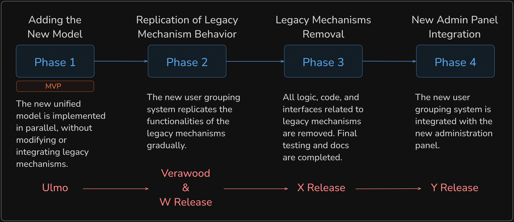

0006. Replication-Based Migration of Legacy User Grouping Mechanisms
####################################################################

Status
******

**Draft** - 2025-06-03

Context
*******

The new unified user grouping system introduced in Open edX is intended to replace the existing grouping mechanisms (cohorts, teams, and course groups) without depending on them directly. To achieve this, a behavior replication strategy was selected: implement, within the new model, the observable functionalities currently provided by legacy mechanisms, but without maintaining synchronization with their internal structures.

This migration aims to fulfill several key requirements for the long-term sustainability of the platform:

- **Maintainability**: Reduce complexity and technical debt by removing redundant and outdated implementations.
- **Extensibility**: Enable the definition of new grouping criteria and behaviors without being constrained by legacy data models or logic.
- **Consistency**: Unify the logic and storage of user grouping to ensure a predictable and coherent behavior across platform features.
- **Efficiency**: Simplify system interactions and avoid the performance and reliability costs of maintaining synchronization layers.
- **Modularity**: Decouple grouping logic from specific platform features to allow reuse across content gating, messaging, discussions, and analytics.

The proposal is organized into four phases to enable a progressive, safe, and decoupled transition from legacy code. Each phase includes specific technical decisions to ensure that the new model can fully assume the responsibilities of the legacy mechanisms without requiring synchronization between systems.

Decision
********

- The new user grouping system will operate independently from the legacy mechanisms and will not rely on their data, APIs, or behaviors.
- The behavior of legacy mechanisms will be functionally replicated in the new system.
- The migration will be divided into four clearly defined phases, each with specific technical goals and expected outcomes:

  - **Phase 1** focuses on implementing the core infrastructure of the new user grouping system, supporting static (manual) groups and laying the foundation for future extensions.
  - **Phase 2** introduces support for dynamic groups and replicates the functional behavior of legacy mechanisms, enabling both systems to coexist temporarily without conflicts.
  - **Phase 3** completes the transition by removing the legacy code, making the new system the only active user grouping source.
  - **Phase 4** finalizes the migration by delivering a centralized administrative interface that consolidates all user group management, replacing temporary or legacy UI elements.
- The new user grouping system must not only use a separate data model but also remain operationally decoupled from legacy systems. For example, features such as content gating will use new plugins based on user groups rather than extending cohort or enrollment track logic.
- The new user grouping system will be gated behind feature flags that allow it to be enabled or disabled at the instance, organization, or course level. This provides platform operators with control over rollout, adoption, and potential mitigation of performance issues. These flags will be available from the early phases and may be retained temporarily after general rollout as a safeguard during stabilization.
- When replicating legacy behaviors, improvements should be made where appropriate to support long-term maintainability. Legacy logic should not be copied as-is if it introduces known issues or technical debt.
- Design decisions should prioritize extensibility and maintainability, aiming for low coupling and high cohesion so that new grouping-related features can be added without deep refactoring.
- Once all functionalities have been replicated (dynamic groups, mutual exclusivity, content access restriction, support for divided discussions, support for ORA assignments, hierarchical structures), the legacy mechanisms will be removed and group management will migrate to a centralized administrative interface. Any legacy behavior that cannot be replicated without compromising the maintainability or design principles of the new system will be reconsidered, redesigned, or removed accordingly.

Consequences
************

- It will be possible to validate that the new system can fully replace the legacy mechanisms, without requiring synchronization or coupling.
- The migration can proceed in a safe and controlled manner, with both implementations coexisting temporarily.
- Existing group data from legacy mechanisms will not be migrated into the new system. The courses that require new grouping behavior must explicitly define groups using the new system. This ensures legacy mechanisms can be sunset cleanly without introducing data integrity risks or transformation logic.

Phases
******

Phase 1: Implementation of the new user grouping system
=======================================================

- A new user grouping model will be implemented with its corresponding entities, allowing the creation of manual (static) groups.
- Only group creation and management via direct user assignment will be supported in this phase.
- Dynamic user groups based on criteria are not included in this phase.
- The system will be deployed behind a feature flag, and a temporary management interface will be exposed via the instructor dashboard.
- There will be no interaction or synchronization with the legacy mechanisms.

Phase 2: Behavior replication of legacy mechanisms functionalities
==================================================================

The unified user grouping system will be extended to support dynamic groups based on criteria and replicate the key functionalities of the legacy mechanisms (cohorts, teams, and course groups). During this phase, both systems will coexist without interference. Functionality will be implemented incrementally, focusing on one functionality at a time.

Functionalities included in this phase:

- **Support for dynamic groups:** Groups can be created manually or generated automatically based on criteria, enabling greater flexibility.
- **Mutual exclusivity:** Groups defined within a group collection must not share users.
- **Content access restriction:** Units or components can be made visible only to users in specific groups.
- **Support for divided discussions:** Users can only see and participate in discussion threads assigned to their group.
- **Support for ORA assignments:** Assignments can be submitted only by members of designated groups.
- **Hierarchical structures:** Groups can be nested or organized into group collections, as introduced in :doc:`0004-refresh-and-consistency-framework`.

Phase 3: Removal of legacy mechanisms
=====================================

Once the replicated functionalities have been validated, the removal of legacy mechanisms will proceed gradually to ensure system stability.

This phase will be executed in the following order:

#. Course groups.
#. Cohorts.
#. Teams.

As part of this process, the following will be removed for each legacy mechanism:

- Models, signals and events related.
- LMS and Studio endpoints and views.
- Configuration and logic in legacy UI and MFEs.
- All related documentation will be updated to reflect the new architecture.

Phase 4: Migration to the new administrative panel
==================================================

- A centralized administrative interface will be developed to manage groupings at the course, organization, and platform levels.
- This new UI will replace the temporary tab in the instructor dashboard.
- It will allow users to create and edit groups, visualize grouping criteria, and perform manual or bulk assignments.
- Access to the interface will be controlled by administrative permissions.
- The documentation will be updated to reflect the new administrative panel.

References
**********

- `Behavior Replication Proposal <https://openedx.atlassian.net/wiki/x/AgDiKgE>`_
